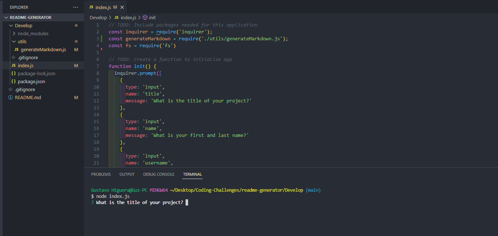
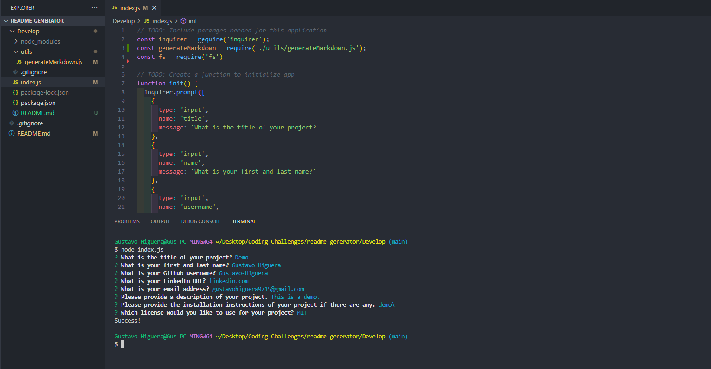
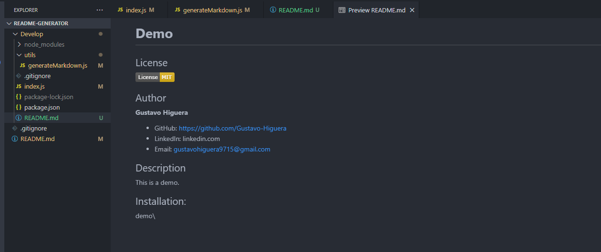

# **Readme Generator**

## License

## Author

**Gustavo Higuera**
* GitHub: https://github.com/Gustavo-Higuera
* LinkedIn: https://www.linkedin.com/in/gustavo-higuera-80322315b/
* Email: gustavohiguera9715@gmail.com

## Description

In this project, I created an application using Node JS. The purpose of this application is to make it easier to generate a professional readme file for your projects. This application is entirely used on the terminal, so there is no live webpage to use. The user is asked questions, and the provided answers are placed into the readme file.

## Installation:

Right click the index.js file, and select "open in intergrated terminal". In the terminal, type "node index.js" without the quotes, and the application will begin! After you are completed with all of the questions, a README.md file will be generated.

## Images 

